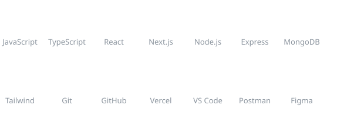

<h1 align="center">Hey, I'm Zishan 👋</h1>
<h3 align="center">Full-Stack Developer | Building MERN apps end-to-end | Open to freelance work</h3>

  

  
  

---

### 🚀 About Me

- 🎓 Self-taught developer, currently deepening skills through **DSA (Striver's A2Z)**, **Next.js**, and **TypeScript**
- 💼 Available for freelance work — landing pages, dashboards, booking/payment systems
- 🌱 Currently building **AutoChirp** — an Instagram DM automation tool using the Meta Graph API
- 📫 Reach me on [LinkedIn](https://linkedin.com/in/zizzy07)

---

### 🛠️ Tech Stack

  

---

### 📌 Featured Projects

| Project | Description | Tech | Link |
|---|---|---|---|
| **[Wanderly](https://wanderly-cfqb.vercel.app)** | Full travel booking platform with live Razorpay payments, admin dashboard, and slot-based booking | MERN, Razorpay, GSAP | [Live Demo](https://wanderly-cfqb.vercel.app) |
| **ShopFlow** | Full e-commerce app — auth, cart, orders, Razorpay checkout | MERN, JWT, Razorpay | [Repo](https://github.com/zishanx) |
| **PageCraft** | Landing page builder with live editor, 4 templates, save/publish flow | MERN | [Repo](https://github.com/zishanx) |
| **ClientDesk** | Client management dashboard | MERN, JWT, Tailwind | [Repo](https://github.com/zishanx) |

---

### 📈 Activity Graph

  

This one draws itself in over ~1-2 seconds each time the page loads.

---

### 📊 GitHub Stats

  
  

  

---

<i>Currently grinding DSA + shipping projects, one day at a time 💪</i>
